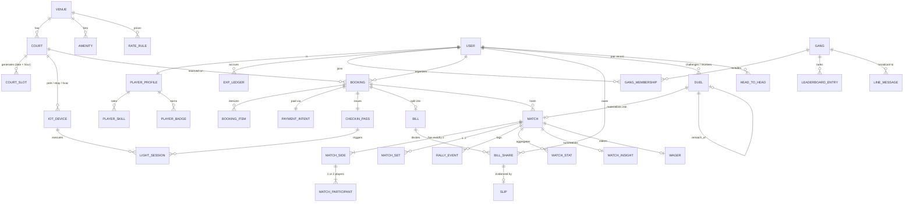

# Winner Court — Reverse-Engineered Domain Model & Backend Contracts

**Source:** 48 extracted UI mockups (`documents/stitch/*`) + `documents/prd.md`.
**Method:** Every field below is anchored to a value *rendered in a mockup*. Where a value exists only in the PRD it is marked `PRD-only`. Where two mockups disagree, both values are carried and the conflict is raised in §9 rather than silently resolved.

**Headline finding:** the mockups imply a materially larger system than the PRD describes — reviews, cash payment, waitlists, partner-finder boards, per-point video replay, calorie/wearable data, court climate sensors, PDF export, badge collections and a 4-tier ID scheme all appear on screen with no PRD backing. Conversely the PRD's core numbers (12 courts, 17:00–23:00, ฿260/hr, `#WC-202410-B84`, 4-hour cancellation, 10-minute hold, deuce detection) are contradicted by nearly every screen. **The schema cannot be frozen until §9 is answered.**

---

## 1. Canonical Conflicts That Block Schema Freeze

These are not cosmetic — each one changes a column type, a constraint, or a state machine.

| # | Field | Mockup values | PRD value | Impact |
|---|---|---|---|---|
| C1 | `booking.reference` format | `#WN-2405-8839`, `#WN-2405-3`, `WN-2024-C03`, `#WC-88429`, `#WC-DUEL43` | `#WC-202410-B84` | 5 incompatible ID schemes; duel IDs and booking IDs share a namespace prefix |
| C2 | `court` count | 6 (`_1`, `2.`, `winner_court_1`) | 12 | Grid width, seeding, capacity math |
| C3 | Bookable hours | 09:00–22:00 (all headers) | 17:00–23:00 | Slot generation window |
| C4 | Hourly rate | ฿160 / ฿180 / ฿200 / ฿220 | ฿260 | 3–4 rate tiers vs 1 |
| C5 | Cancellation window | 3 h (`_3`, `winner_court_2`) | 4 h | Refund policy engine |
| C6 | Payment hold | 15 min (`_3`), 9:42 seed (`promptpay_qr`) | 10 min | `payment_intent.expires_at` |
| C7 | Duel format | Doubles 3×21 (`duel_accepted_match_locked`, `line_match_challenge_flex_message`) vs Singles 1×30 (`4_court_4_live_scoreboard`, `rematch_*`) | Singles 30 | 1v1 vs 2v2 changes `match_participant` cardinality and all H2H math |
| C8 | Deuce | `"30 แต้มจบ ไม่ดิวซ์"` (no deuce) on the scoreboard vs `"ดิวซ์ 28-28"`, `"Deuce x2"` everywhere else | Automated deuce detection | Scoring rule engine |
| C9 | EXP per win | `+100` (`past_duels_history`, duel cards) vs `+50 / +85` (`leaderboard_ranking` published rules) | unspecified | EXP ledger is unreconcilable; neither reproduces the displayed totals |
| C10 | IoT court | Court 3 (`check_in_pass_qr_code`, `court_light_activated_feedback`) vs Court 4 (`4_full_screen_*`, `4_court_light_turned_on_feedback`) | Court 4 | Which booking the pass belongs to |
| C11 | Gang headcount | 5 (bill), 6 (LINE group), 8 (duel chat group) | 6 players @ ฿120 | `bill.headcount` ≠ `gang.member_count` — needs two distinct fields |
| C12 | Court surface | Court 3 = `พื้นยาง BWF` / `ปาร์เกต์` / `ไม้ปาร์เกต์พรีเมียม`; Court 4 = `ยางน้ำเงิน` / `ปาร์เกต์` / `ยางเกรด A` / `ยางสังเคราะห์` | BWF rubber mats | Court metadata is free-text in practice |

---

## 2. Domain Model

### 2.1 Identity, Social & Progression

#### `user`
| Field | Type | Example (source) |
|---|---|---|
| `id` | uuid | — |
| `line_user_id` | text UNIQUE | implied by `"เชื่อมต่อผ่าน LINE แล้ว"` (`winner_court_2`) |
| `line_display_id` | text | `@ton_badminton` (`winner_court_2`) |
| `display_name` | text | `คุณต้น`, `น้องมายด์ (Mind N.)`, `Ken (คุณ)` |
| `legal_name` | text NULL | `นายจิรภัทร สุขสมบูรณ์` (`100`) |
| `avatar_url` | text | `lh3.googleusercontent.com/aida/…` (placeholder in all 44 screens) |
| `phone` | text NULL | `081-234-5678` (`winner_court_2` — note: same digits as venue hotline) |
| `promptpay_id` | text NULL | `0812345678` (`split_bill_line_share`) |
| `emergency_phone` | text NULL | `081-234-5678` (`winner_court_2`) |
| `home_court_id` | fk `court` NULL | `"สนามเหย้า: Winner Court Bangkok (สนาม 3 ประจำ)"` (`player_career_stats`) |
| `created_at` / `updated_at` | timestamptz | — |

#### `player_profile` (1:1 with `user`)
| Field | Type | Example |
|---|---|---|
| `user_id` | fk PK | — |
| `player_card_no` | text UNIQUE | `#WC-88429` (`line_player_card_flex_message`) |
| `level` | int | `28` (Mind), `24` → `25` (Ken) |
| `exp_total` | int | `2840` (Mind), `1810` (Ken) |
| `exp_next_level` | int | `3000` (`player_career_stats`), `2000` (`duel_lobby_match_center`) |
| `tier_title` | text | `Court Master` — ⚠️ PRD specifies `Smash Master / Net Magician / Consistent Wall`; none appear |
| `archetype` | text | `Frontcourt Tactician (S Class)`, `Tactician`, `Playmaker`, `All-Arounder`, `Rookie Rising` |
| `tagline` | text | `สายดักหน้าเน็ต & เทคนิคอลเพลย์เยอร์ 🌿` |
| `matches_played` | int | `142` (Mind), `88` (Ken) |
| `wins` / `losses` | int | `98` / `44` |
| `win_rate_pct` | numeric(4,1) | `69.0` — **derived**, do not store (98/142 = 69.01%) |
| `current_streak` | int | `5` (`"5 แมตช์ติด 🔥"`) |
| `court_hours_total` | numeric | `114` (`player_career_stats`) — ⚠️ no derivation rule given |
| `calories_total` | int | `48200` (`~48,200 kcal`) — ⚠️ no data source exists |
| `is_verified` | bool | `verified` glyph on the player card |
| `availability` | enum | `พร้อมลงแข่ง` (only state designed) |

#### `player_skill` (long-form, 5 rows/player)
| Field | Type | Example |
|---|---|---|
| `player_id` | fk | Mind |
| `skill` | enum(`net_play`,`agility`,`placement`,`stamina`,`smash_power`) | `net_play` |
| `score` | int 0–100 | `94` |
| `grade` | enum(`S`,`A+`,`A`,…) NULL | `S` |
| ⚠️ | | Mind's `smash_power=72` (weakest) contradicts her `256 km/h` peak smash in `match_insights_wc_duel43` |

#### `badge` / `player_badge`
| Field | Type | Example |
|---|---|---|
| `code` | text PK | `net_killer`, `three_set_warrior`, `regular_friday`, `capy_favorite` |
| `emoji` | text | `🥇`, `⚔️`, `📅`, `🦫` |
| `label` | text | `Net Killer` |
| `criterion` | text | `หยอดเน็ตเกิน 100 ลูก` |
| `player_badge.earned_at` | timestamptz | — |
| `total_badge_count` | int | `24` (`ดูเหรียญทั้งหมด (18/24)`) — no locked-state tile is designed |

#### `gang`
| Field | Type | Example |
|---|---|---|
| `id` | uuid | — |
| `name` | text | `ก๊วนแบดวันศุกร์ ตีเอาเหงื่อ 🏸⚡` / `ก๊วนวันศุกร์ (Friday Gang)` / `ก๊วนแบดวันศุกร์ (Winner Court)` — 3 names, 1 gang |
| `line_group_id` | text | required for push; never surfaced |
| `member_count` | int | `6` (most chats), `8` (`line_post_match_duel_victory_flex`) |
| `home_venue_id` | fk `venue` | Winner Court BKK |
| `season_label` | text | `Season 4` (`leaderboard_ranking`) |

#### `gang_membership`
`gang_id`, `user_id`, `role` ∈ {`captain`/`ผู้จัดก๊วน`, `member`}, `joined_at`, `avatar_initial` (`ต`,`น`,`บ`,`ป`,`ม`).

#### `exp_ledger` — append-only
| Field | Type | Example |
|---|---|---|
| `id` | uuid | — |
| `player_id` | fk | Ken |
| `source_type` | enum | `match_win`, `match_participation`, `deuce_bonus`, `duel_win`, `duel_loss_consolation`, `share_flex`, `spectator_bonus` |
| `source_ref` | text | `#WC-DUEL43` |
| `amount` | int | `+240` (`30_4_court_4_victory_summary`), `+100`, `+85`, `+50`, `+35`, `+30`, `+20` |
| `awarded_at` | timestamptz | — |
| ⚠️ | | 12 wins × 100 + 8 × 20 = 1,360 ≠ displayed `+1,420 EXP`. The ledger is the only way to make these reconcile; **totals must be derived from it, never stored independently.** |

---

### 2.2 Venue & Inventory

#### `venue`
| Field | Type | Example |
|---|---|---|
| `id` | uuid | — |
| `name_th` / `name_en` | text | `วินเนอร์ คอร์ท` / `Winner Court` |
| `legal_entity` | text | `บจก. วินเนอร์ สปอร์ต คลับ` (`promptpay_qr`) |
| `tax_id` | text | `0105562089421` |
| `branch` | text | `สาขาพระราม 9` (component sheet) — ⚠️ vs `Ramkhamhaeng 24` address |
| `address` | text | `ซอยรามคำแหง 24 แยก 14 แขวงหัวหมาก บางกะปิ กรุงเทพฯ` |
| `phone` | text | ⚠️ 3 values: `021234567` (`_2`), `0812345678` (`_3`, `empty_state`), `081-234-5678` (`winner_court_1`) |
| `maps_url` | text | `https://maps.google.com` (generic — not a place pin) |
| `line_oa_url` | text | `https://line.me` (generic — not an OA deep link) |
| `opens_at` / `closes_at` | time | `09:00` / `22:00` — ⚠️ C3 |
| `court_count` | int | `6` — ⚠️ C2 |
| `rating_avg` | numeric(2,1) | `4.8` — ⚠️ reviews feature absent from PRD |
| `review_count` | int | `142` |
| `photos[]` | text[] | 3 carousel slides |

#### `amenity` (venue-scoped, 6 rows)
`icon` (`local_parking`,`mode_fan`,`shower`,`local_cafe`,`handyman`,`wifi`), `title` (`ที่จอดรถ 30 คัน` — ⚠️ PRD says 50+), `subtitle` (`จอดฟรีในร่ม`).

#### `court`
| Field | Type | Example |
|---|---|---|
| `id` | uuid | — |
| `venue_id` | fk | — |
| `number` | int | `1`–`6` |
| `label` | text | `คอร์ท 3` |
| `surface` | enum/text | ⚠️ `ยางเขียว`, `ยางน้ำเงิน`, `ปาร์เกต์`, `พื้นยาง BWF`, `ไม้ปาร์เกต์พรีเมียม`, `ยางสังเคราะห์`, `สนามยาง 4 มม.`, `ยางเกรด A` (C12) |
| `climate` | enum | `แอร์` \| `พัดลม` |
| `ac_setpoint_c` | int NULL | ⚠️ `22` / `23` / `24` across three screens |
| `floor` | text | `ชั้น 2` |
| `zone` | text | `Zone A คอร์ทแอร์` |
| `status` | enum | `active` \| `maintenance` |
| `is_featured` | bool | `คอร์ท 3 ★` (`2.`) |
| `lux_rating` | int NULL | PRD-only (500 lux); mockups show `800W LED` instead |

#### `rate_rule` — resolves C4 as data, not code
| Field | Type | Example |
|---|---|---|
| `id` | uuid | — |
| `venue_id` | fk | — |
| `name` | text | `ช่วงพีค 17:00-21:00` |
| `day_mask` | int[] | Mon–Fri = `[1..5]`; `เสาร์-อาทิตย์ / วันหยุดนักขัตฤกษ์` |
| `starts_at` / `ends_at` | time | `17:00` / `22:00` |
| `price_thb` | int | `220` (peak), `180`/`160` (standard), `180` (21:00 closing), `200` (⚠️ `empty_state` only) |
| `is_peak` | bool | `true` |

#### `court_slot` — materialized availability (or computed view)
| Field | Type | Example |
|---|---|---|
| `court_id` | fk | Court 3 |
| `play_date` | date | `2024-05-24` (BE `2567`) |
| `starts_at` / `ends_at` | time | `19:00` / `20:00` |
| `status` | enum | `available` \| `booked` \| `maintenance` \| `held` \| `past` |
| `price_thb` | int | `220` (from `rate_rule`) |
| `booking_id` | fk NULL | — |
| ⚠️ | | `_1`'s grid is **discontinuous** — 12:00, 14:00, 16:00 rows are absent from the markup despite 09:00–22:00 hours |

#### `day_availability_summary` — powers `_2` / `winner_court_1` / `empty_state`
`play_date`, `free_court_count` (`ว่าง 8 คอร์ท` ⚠️ > 6 courts), `free_slot_count` (`เหลือ 5 ช่วงเวลา` ⚠️ only 3 chips render), `is_fully_booked`, `label` (`ว่างเยอะ`, `เต็มทุกช่อง`, `ผ่านไปแล้ว`).

#### `waitlist_subscription` — ⚠️ not in PRD
`user_id`, `venue_id`, `play_date`, `channel` = `line`, `created_at`. Trigger: `_2`'s `เปิดแจ้งเตือนหากมีคนสละสิทธิ์คอร์ทวันนี้`.

---

### 2.3 Booking & Payment

#### `booking`
| Field | Type | Example |
|---|---|---|
| `id` | uuid | — |
| `reference` | text UNIQUE | `#WN-2405-8839` — ⚠️ C1 |
| `venue_id` / `court_id` | fk | Court 3 |
| `organizer_id` | fk `user` | คุณต้น |
| `gang_id` | fk NULL | ก๊วนแบดวันศุกร์ |
| `play_date` | date | `วันศุกร์ที่ 24 พ.ค. 2567` |
| `starts_at` / `ends_at` | time | `19:00` / `21:00` |
| `duration_hours` | numeric | `2` (`2 ชั่วโมงเต็ม`, `2 ชั่วโมงติดกัน`) |
| `is_peak` | bool | `true` (`Peak Hour Slot`) |
| `headcount` | int | `4-6 คน` (`_3`), `5` (bill) — ⚠️ C11 |
| `subtotal_thb` / `total_thb` | int | `440` |
| `status` | enum | see §8.1 |
| `payment_method` | enum | `promptpay` \| `card` \| `cash_counter` — ⚠️ last two absent from PRD |
| `contact_phone` | text | `081-234-5678` |
| `hold_expires_at` | timestamptz | ⚠️ C6 |
| `cancellation_deadline` | timestamptz | `start − 3h` — ⚠️ C5 |
| `checkin_pass_id` | fk NULL | `WN-2024-C03` |
| `created_at` / `confirmed_at` / `cancelled_at` | timestamptz | — |

#### `booking_item`
| Field | Type | Example |
|---|---|---|
| `booking_id` | fk | — |
| `kind` | enum | `court_fee` \| `platform_fee` \| `shuttlecock` \| `racket_rental` (PRD-only) |
| `label` | text | `ค่าคอร์ทช่วงพีค (฿220 × 2 ชม.)`, `ค่าบริการระบบจอง`, `ค่าลูกแบด RSL` |
| `unit_price_thb` | int | `220`, `0`, `80` |
| `qty` | numeric | `2` hrs, `2 หลอด` |
| `amount_thb` | int | `440`, `0` (`ฟรีช่วงเปิดตัว`), `160` |
| `promo_tag` | text NULL | `ฟรีช่วงเปิดตัว` |
| ⚠️ | | `winner_court_2` bills ฿440 total while `100` bills ฿600 for the *same session* — the shuttlecock line is added post-booking |

#### `payment_intent`
| Field | Type | Example |
|---|---|---|
| `id` | uuid | — |
| `booking_id` | fk | — |
| `method` | enum | `promptpay` |
| `amount_thb` | numeric(10,2) | `440.00` |
| `currency` | char(3) | `THB` |
| `status` | enum | see §8.1 |
| `expires_at` | timestamptz | seed `09:42` remaining |
| `qr_payload` | text | EMVCo string — **the mockup ships a hand-drawn decorative SVG that encodes nothing** |
| `beneficiary_name` | text | `บจก. วินเนอร์ สปอร์ต คลับ (Winner Court)` |
| `beneficiary_tax_id` | text | `0105562089421` |
| `bank_ref` | text NULL | from webhook |
| `paid_at` | timestamptz | — |

#### `checkin_pass`
| Field | Type | Example |
|---|---|---|
| `id` | text | `WN-2024-C03` / `#WN-2405-3` — ⚠️ C1 |
| `booking_id` | fk | — |
| `qr_token` | text (rotating) | refresh interval `60` s, countdown `48s` / `42s` |
| `token_expires_at` | timestamptz | — |
| `backup_pin` | char(4) | `4389` — ⚠️ **static & shareable to a LINE group** (§9-Q14) |
| `available_from` | timestamptz | PRD: `start − 15 min`; `30_pre_match_notification` exposes it at `T−30` |
| `auto_activate_at` | time | `18:55` (court 3) / `19:55` (court 4) |
| `scanned_at` | timestamptz NULL | — |

---

### 2.4 Split Bill & Slip Verification

#### `bill`
| Field | Type | Example |
|---|---|---|
| `id` | uuid | — |
| `reference` | text | `#WN-2405-3` |
| `booking_id` | fk | — |
| `gang_id` | fk | — |
| `organizer_id` | fk | คุณต้น / นายจิรภัทร |
| `organizer_promptpay` | text | `0812345678` |
| `court_amount_thb` | int | `440` |
| `extras_amount_thb` | int | `160` |
| `extras_label` | text | ⚠️ `Speed 76 x 2 หลอด` (`split_bill_line_share`) vs `ค่าลูกแบด RSL` (`100`) vs PRD `3 tubes RSL Silver = ฿1,140` |
| `include_extras` | bool | toggle → total flips `600 ↔ 440` |
| `total_thb` | int | `600` |
| `headcount` | int | `5` (range 2–12) — ⚠️ C11 |
| `per_person_thb` | int | `120` = `ceil(total/headcount)` |
| `rounding_note` | text | `ปัดเศษเรียบร้อย` |
| `paid_count` | int | `3` → `4` → `5` |
| `collected_to_organizer_thb` | int | `480` (= 4 × 120; captain's own share nets out) |
| `status` | enum | see §8.2 |
| `closed_at` | timestamptz | `18:55` |

**Derived breakdown displayed:** `court_per_person = round(440/5) = ฿88`, `extras_per_person = round(160/5) = ฿32`. Note `88+32 = 120` only by luck; expose both as computed fields, never stored.

#### `bill_share`
| Field | Type | Example |
|---|---|---|
| `id` | uuid | — |
| `bill_id` | fk | — |
| `user_id` | fk | ปาล์ม |
| `amount_thb` | int | `120` |
| `status` | enum | `pending` \| `submitted` \| `verified` \| `deducted` \| `failed` |
| `status_label` | text | `รอโอน`, `ตรวจผ่านแล้ว`, `หักเคลียร์`, `คนปิดบิล!` |
| `is_organizer_offset` | bool | `true` for captain (`สำรองจ่ายเรียบร้อย`) |
| `is_final_closer` | bool | `true` for มายด์ (`ปิดบิลสุดท้าย 🎉`) |
| `paid_at` | timestamptz | ⚠️ `18:35`/`18:40` (`100`) vs `21:05`/`21:12` (`split_bill_line_share`) for the same two members |
| `nudged_at` | timestamptz NULL | `สะกิดแล้ว` |
| `nudge_count` | int | — |

#### `slip`
| Field | Type | Example |
|---|---|---|
| `id` | uuid | — |
| `bill_share_id` | fk | — |
| `image_url` | text | `K PLUS Slip_240524.jpg` |
| `bank_code` | text | ⚠️ `KBank` (`member_slip_upload_verification`) vs `PromptPay` (`100`) for the same slip |
| `ocr_amount_thb` | numeric | `120.00` |
| `ocr_time` | time | `18:42` |
| `ocr_reference` | text | `01414318428174` |
| `ocr_recipient` | text | PRD requires recipient-account validation; not rendered |
| `verification_status` | enum | `pass` (`ตรงตามเงื่อนไข`) \| `amount_mismatch` \| `wrong_recipient` \| `unreadable` — ⚠️ **only `pass` is designed** |
| `verified_at` | timestamptz | — |

---

### 2.5 IoT: Light Sessions & Devices

#### `iot_device`
| Field | Type | Example |
|---|---|---|
| `id` | text PK | `#43-AUTO` / `#43-AUTO-LIGHT` — ⚠️ two IDs, one pole |
| `court_id` | fk | Court 4 |
| `kind` | enum | `light_pole_scanner` \| `relay` \| `hvac` \| `scoreboard` |
| `fixture_watts` | int | `800` — ⚠️ PRD specifies `500 lux`, not watts |
| `mqtt_topic` | text | `winnercourt/venue/{v}/court/{c}/relay` |
| `online` | bool | `เชื่อมต่อพร้อม` |
| `last_heartbeat_at` | timestamptz | — |

#### `light_session`
| Field | Type | Example |
|---|---|---|
| `id` | uuid | — |
| `booking_id` \| `match_id` | fk | `#WC-DUEL43` |
| `court_id` / `device_id` | fk | Court 4 / `#43-AUTO` |
| `trigger` | enum | `qr_scan` \| `backup_pin` \| `cloud_trigger` \| `schedule_auto` |
| `activated_at` | timestamptz | `19:55` |
| `duration_min` | int | ⚠️ `60` (`4_court_light_turned_on_feedback`) vs `120` (`court_light_activated_feedback`, `เหลือ 1 ชม. 59 น.`) |
| `ends_at` | timestamptz | `21:00` |
| `warning_sent_at` | timestamptz | PRD: `end − 5 min` — **not rendered on any screen** |
| `state` | enum | see §8 |
| `ack_latency_ms` | int | KPI target `<1200` |
| `auxiliaries` | jsonb | `{ac: {setpoint: 22, state: "cooling"}, scoreboard: "Court 4 Live", shuttles: {tubes: 2, pickup: "counter"}}` |

---

### 2.6 Match, Scoring & Analytics

#### `match`
| Field | Type | Example |
|---|---|---|
| `id` | uuid | — |
| `reference` | text | `#WC-DUEL43`, `#WC-DUEL42`, `#WC-DUEL41`, `#WC-DUEL39`, `#WC-DUEL35`, `#WC-DUEL31` |
| `booking_id` | fk NULL | — |
| `court_id` | fk | Court 4 / Court 3 |
| `gang_id` | fk | — |
| `duel_id` | fk NULL | when originated from a challenge |
| `format` | enum | `singles_30_single_set` \| `doubles_bo3_21` \| `singles_bo3_21` |
| `format_label` | text | `1 เซต 30 แต้มชี้ชะตา (Deciding 30)`, `ประเภทคู่ผสม 3 เซต 21 แต้ม`, `แมตช์ 2 ใน 3 เซต` |
| `deuce_enabled` | bool | ⚠️ C8 |
| `max_points` | int | `30` / `21` |
| `status` | enum | see §8.3 |
| `scheduled_at` | timestamptz | `2024-05-31 20:00` |
| `started_at` / `ended_at` | timestamptz | `21:42` finish (`match_insights_wc_duel43`) — ⚠️ but the Flex insights card is stamped `21:07` |
| `duration_min` | int | `52` (duel) / `48` (doubles) |
| `court_time_remaining_min` | int | `54:12`, `1 ชม. 38 นาที`, `1 ชม. 12 นาที` |
| `winner_side` | enum | `A` \| `B` |
| `mvp_user_id` | fk NULL | มายด์ (doubles only) |
| `wager_id` | fk NULL | — |
| `broadcast_enabled` | bool | `Live Sync`, refresh `15 s` |
| `rally_density` | numeric | `9.4 แรลลี่/แต้ม` |
| `total_points` | int | `58` (duel) / `42` (set 3 only) / `120` (full doubles match) — ⚠️ scope of the counter is ambiguous |

#### `match_side` (2 per match) & `match_participant`
| Field | Type | Example |
|---|---|---|
| `match_side.side` | enum | `A` \| `B` |
| `match_side.label` | text | `ทีม A`, `ทีมผู้ท้าชิง`, `ทีมแชมป์เก่า 👑` |
| `match_side.sets_won` | int | `2` |
| `match_side.is_serving` | bool | `กำลังส่ง (คอร์ทขวา)` |
| `match_side.court_side` | enum | `right` \| `left` — ⚠️ `match_scoreboard` labels **both** sides `คอร์ทขวา`, which is impossible under BWF |
| `match_participant.user_id` | fk | — |
| `match_participant.level_at_match` | int | `24` / `28` |
| `match_participant.role_label` | text | `ผู้ท้าล้างตา`, `แชมป์ประจำซอย` |

#### `match_set`
`match_id`, `index` (`1`,`2`,`3`), `score_a`, `score_b` (`21-17`, `19-21`, `20-22`), `winner_side`, `is_deuce` (`เซตตัดสิน (ดิวซ์)`), `is_tiebreak`, `ended_at`.

> ⚠️ **Score-order bug:** the same set is written `20 - 22` (A-first) in the table and `22-20` (B-first) in the tab label, chart milestone, and the copyable LINE text (`flex_message_line_post_match_summary_flex`). **Persist `score_a`/`score_b` bound to `side`, never a display string.**

#### `rally_event` (the point log / 58-point replay)
| Field | Type | Example |
|---|---|---|
| `id` | uuid | — |
| `match_id` / `set_index` | fk / int | — |
| `sequence` | int | 1..58 |
| `scoring_side` | enum | `A` |
| `scorer_user_id` | fk NULL | น้องมายด์ |
| `shot_type` | enum | `smash_kill`, `drop_shot`, `slice`, `net_kill`, `push_kill`, `line_winner`, `service_fault`, `unforced_error`, `long_rally` |
| `shot_label` | text | `⚡ ตบฝัง Smash`, `🌿 หยอดหน้าเน็ต`, `❌ ลูกออก/ติดเน็ต` |
| `rally_shots` | int | `38`, `22`, `18`, `14`, `12`, `8` |
| `rally_seconds` | int | `74` (`1 นาที 14 วินาที`) |
| `speed_kmh` | int NULL | `284`, `256`, `245`, `210` |
| `score_a_after` / `score_b_after` | int | `30` / `28` |
| `is_key_point` | bool | `🏆 Championship Point`, `Match Point`, `ดิวซ์ 20-20` |
| `commentary_th` | text | `[Smash Kill] Ken เทคตัวกระโดดฟาดสแมชครอสคอร์ท…` |
| `occurred_at` | timestamptz | `21:42` |
| `video_clip_url` | text NULL | `ดูมุมกล้อง Court 4 Cam` — ⚠️ camera system absent from PRD |

> ⚠️ Undo: the scoreboard's `-1` decrements the score but **does not delete the rally row it created**, so log and score desync. `rally_event` needs a `voided_at` column and the `-1` must void the last row.

#### `match_stat` (per participant, per match)
| Field | Type | Example |
|---|---|---|
| `smash_winners` | int | `14` / `11` |
| `peak_smash_kmh` | int | `284` / `256` — ⚠️ labelled `Avg Smash Speed` in `30_4_court_4_victory_summary`, `สปีดสูงสุด` elsewhere |
| `net_drop_points` | int | `8` / `9` |
| `unforced_errors` | int | `6` / `9` |
| `net_intercepts` | int | `9` |
| `service_aces` | int | `2` |
| `court_coverage_pct` | int | `82`, `78` |
| `smashes_returned` | int | `14` |

#### `match_insight` (AI / derived, 1 per match)
`match_id`, `lead_changes` (`4`), `biggest_comeback` (`Ken ตาม 4-8 สู่ 16-14`), `longest_rally_shots` (`38`), `longest_rally_at` (`28-28`), `momentum_series` (jsonb — the SVG polyline points), `zone_win_pct` (`{net: {A:32,B:68}, backcourt: {A:58,B:42}}`), `match_iq` (`94/100`), `coach_summary_th`, `coach_tags` (`#MentalToughness`).

#### `match_photo` — ⚠️ not in PRD
`match_id`, `url`, `source` = `กล้องอัตโนมัติคอร์ท 4`, `caption`.

---

### 2.7 Duels, Wagers & Leaderboards

#### `duel` (challenge sheet → accepted → locked)
| Field | Type | Example |
|---|---|---|
| `id` | uuid | — |
| `reference` | text | `#WC-DUEL42`, `#WC-DUEL43` |
| `kind` | enum | `challenge` \| `rematch` \| `partner_request` |
| `source_match_id` | fk NULL | `#WC-DUEL39` (the 28-30 loss being avenged) |
| `challenger_user_id` | fk | Ken |
| `opponent_user_id` | fk | น้องมายด์ |
| `challenger_partner_id` / `opponent_partner_id` | fk NULL | กัปตันต้น / ปาล์ม |
| `mode` | enum | `rival` (`ท้าดวลคนละฝั่ง`) \| `coop` (`ชวนเป็นคู่หู`) |
| `category` | enum | `singles` \| `doubles` \| `mixed_doubles` |
| `set_format` | enum | `bo3_21` \| `single_30` |
| `court_id` / `play_date` / `starts_at` / `ends_at` | | Court 3, `2024-05-31`, `19:00`–`20:00` |
| `fee_thb` / `fee_split` | int / enum | `220` total, `50/50` → `฿110/คน` |
| `deposit_paid` | bool | `ชำระมัดจำแล้ว` |
| `message_th` | text | editable trash-talk textarea |
| `status` | enum | see §8.4 |
| `respond_by` | timestamptz | ⚠️ `6 ชม.` (`match_challenge_sheet`) vs `12 ชั่วโมง` (`rematch_challenge_sheet`); countdown shown as `5 ชม. 48 น.` / `11:48 ชม.` |
| `exp_win` / `exp_lose` | int | `+100`/`+20`, `+150`/`+30` (rematch bonus) |
| `line_message_id` | text | for editing the pushed Flex |
| `accepted_at` / `declined_at` / `expired_at` | timestamptz | — |

#### `wager`
| Field | Type | Example |
|---|---|---|
| `id` | uuid | — |
| `duel_id` \| `match_id` | fk | — |
| `type` | enum | `boba` \| `shuttlecock` \| `meal` \| `sports_drink` \| `court_fee` (PRD-only) |
| `emoji` | text | `🧋`, `🏸`, `🍜`, `🥤` |
| `description_th` | text | `ชานมไข่มุก x2 แก้วใหญ่ (หวาน 100%)` |
| `quantity` | int | `2` |
| `multiplier` | text NULL | `2X STAKES` (rematch) |
| `settle_status` | enum | `pending` \| `settled` |
| `settled_by_user_id` | fk | น้องมายด์ (`Paid by Mind` / `Paid โดยน้องมายด์`) |
| `settle_location` | text | `Winner Cafe (หน้าคอร์ท 4)` |

#### `head_to_head` (materialized pair stat)
`user_a`, `user_b`, `wins_a`, `wins_b`, `last_match_id`, `last_score`.
Values seen: `Mind 3 - 2 Ken` (pre-duel) → `3 - 3` (post-duel), `H2H 2 - 1` (team).
> ⚠️ `30_4_court_4_victory_summary` shows `3 - 3` with subtext `จากเดิมแพ้ 2 ชนะ 3` (= 3-2), which after a win would be 4-2. The prior record should read 2-3.

#### `leaderboard_entry`
| Field | Type | Example |
|---|---|---|
| `gang_id` | fk | — |
| `season` | text | `Season 4` |
| `timeframe` | enum | `weekly` \| `season` \| `all_time` |
| `period_start` / `period_end` | timestamptz | cut-off Sunday midnight (`ตัดรอบใน 2วัน 04:02:18`) |
| `rank` | int | `1`..`8` |
| `player_id` | fk | มายด์ |
| `exp` | int | `2840`, `2640`, `2410`, `2280`, `1950`, `1810`, `1620`, `1410` |
| `matches` / `wins` | int | `142` / `98` |
| `win_rate_pct` | numeric | `69` |
| `rank_delta` | int | `+1`, `-1`, `0` (`▲ 1 อันดับ`, `▼ 1 อันดับ`, `เสมอ`) |
| `exp_today` | int | `+85`, `+60`, `+45`, `+35` |
| `streak` | int | `5` |
| `is_mvp` | bool | `true` for rank 1 |

#### `mvp_prize`
`gang_id`, `period_end`, `description` (`คูปองเครื่องดื่มเย็น 2 แก้ว + ปลอกกริป Yonex`), `awarded_to`, `awarded_at`.

#### `partner_request` — ⚠️ entirely absent from PRD
`user_id` (กัปตันต้น), `court_id`, `play_date`, `starts_at`/`ends_at` (`17:00-18:30`), `slots_needed` (`ขาด 1 คน!`), `category` (`ชายคู่`), `note`, `fee_split` (`หารค่าคอร์ทเท่ากัน`), `status`.

---

### 2.8 Notifications & LINE Messaging

#### `line_message`
| Field | Type | Example |
|---|---|---|
| `id` | uuid | — |
| `template` | enum | see §6 |
| `target_type` / `target_id` | enum / text | `group` / `line_group_id` |
| `entity_type` / `entity_id` | text | `bill` / `bill_id` |
| `line_message_id` | text | for later edit/repost |
| `sent_by` | enum | `bot_auto` \| `user_manual` |
| `sent_at` | timestamptz | `18:56`, `19:56`, `20:16`, `21:07` |
| `read_count` | int | `อ่านแล้ว 5` |
| `payload_json` | jsonb | the Flex JSON actually sent |

#### `notification`
`user_id`, `kind` ∈ {`pre_match_30min`, `pre_match_bot_card`, `light_on`, `waitlist_slot_free`, `bill_nudge`, `duel_received`, `duel_accepted`, `weekly_leaderboard`, `payment_confirmed`}, `channel` = `line`, `scheduled_for`, `sent_at`, `payload`.

---

## 3. ER Description



**Cardinality notes worth flagging**
- `match_side` is fixed at 2; `match_participant` is 1 or 2 per side. This is the *only* structure that accommodates both the singles duel (`4_court_4_live_scoreboard`) and the doubles match (`match_scoreboard`) without two parallel schemas — the two mockups currently imply incompatible models (C7).
- `booking : bill` is `1 : 0..1`, but `bill.total_thb (600) ≠ booking.total_thb (440)` because extras are appended after booking. `bill` must own its own line items, not read `booking_item`.
- `duel → match` is `1 : 0..1` — a duel can expire without producing a match (`past_duels_history` shows completed duels; `duel_lobby_match_center` shows pending ones that have not yet materialized).
- `checkin_pass → light_session` is `1 : 0..n` (cloud-trigger fallback and backup-PIN can both create sessions).

---

## 4. Endpoints & Realtime Channels, Screen by Screen

Base: `/api/v1`. All authenticated by LIFF ID token → `line_user_id`.

### 4.1 Booking Flow

| Screen (dir) | Endpoints | Realtime |
|---|---|---|
| `winner_court_1` — Court Profile | `GET /venues/{id}` (name, hours, rating, review_count, address, maps_url, phone) · `GET /venues/{id}/photos` · `GET /venues/{id}/amenities` · `GET /venues/{id}/rate-rules` · `GET /venues/{id}/availability/today?summary=bands` → `{bands:[{label:"ช่วงบ่าย (13:00-16:00)",courts:[2,4,5],free:3,price:180}, …], total_free_slots:5}` | — |
| `_1` — Booking grid default | `GET /venues/{id}/date-strip?days=14` · `GET /venues/{id}/slots?date=2024-05-24` → matrix `{courts[], rows[{time, cells[{court_id,status,price}]}]}` | `ws /venues/{id}/slots` — `slot.status_changed` |
| `2.` — 2-hour selection | `POST /bookings/quote` `{court_id,date,slots:[19:00,20:00]}` → `{hours:2,is_peak:true,total:440,breakdown[]}` (server must validate contiguity) | same |
| `_2` — Fully booked | `GET /venues/{id}/slots?date=…` → `{fully_booked:true}` · `GET /venues/{id}/recommendations?after=2024-05-24` → `{date, window, courts[], free_count}` · `POST /waitlist` `{venue_id,date}` · `DELETE /waitlist/{id}` | push on `slot.released` |
| `winner_court_2` — Review & checkout | `GET /bookings/draft/{id}` · `PATCH /bookings/draft/{id}` `{contact_phone, payment_method}` · `POST /bookings` → `{booking_id, reference, status:"pending_payment", hold_expires_at}` | — |
| `promptpay_qr` — PromptPay | `POST /bookings/{id}/payment-intents` → `{qr_payload, expires_at, beneficiary}` · `GET /payment-intents/{id}` (poll fallback) · `POST /payment-intents/{id}/claim` (the manual `แจ้งว่าชำระเงินแล้ว` CTA) | `ws /payment-intents/{id}` — `payment.settled`, `payment.expired` |
| `line` — Booking success | `GET /bookings/{id}` · `POST /bookings/{id}/share-text` → plain-text summary · `POST /bookings/{id}/share-flex` → LIFF `shareTargetPicker` payload · `GET /bookings/{id}/calendar.ics` | — |
| `_3` — My Bookings | `GET /me/bookings?status=upcoming&page=1` / `?status=past` (⚠️ counts say 5, list returns 3 — needs real pagination) · `POST /bookings/{id}/cancel` · `GET /bookings/{id}/receipt` · `POST /bookings/{id}/rebook` | `ws /me` — `booking.status_changed` for the countdown pill |
| `empty_state` — My Bookings empty | `GET /me/bookings?limit=1` → `{total:0}` · `GET /venues/{id}/availability/today` · `GET /venues/{id}/tips` | — |

### 4.2 Split Bill

| Screen | Endpoints | Realtime |
|---|---|---|
| `split_bill_line_share` — Calculator | `POST /bookings/{id}/bill` · `PATCH /bills/{id}` `{headcount, include_extras, extras}` → recomputes `per_person` server-side · `GET /bills/{id}` · `POST /bills/{id}/shares/{share_id}/nudge` · `POST /bills/{id}/share-flex` · `GET /bills/{id}/summary-text` | `ws /bills/{id}` |
| `line_line_chat_bubble_preview` — Bill Flex preview | `GET /bills/{id}/flex-preview` → the exact Flex JSON · `POST /bills/{id}/push` `{target: line_group_id}` | — |
| `member_slip_upload_verification` — Member modal | `GET /bills/{id}/shares` · `POST /bills/{id}/shares/{share_id}/claim` (`เลือกชื่อผู้โอน`) · `POST /bills/{id}/shares/{share_id}/slip` (multipart) → async OCR · `GET /slips/{id}` → `{status, ocr:{amount,time,reference}}` · `GET /bills/{id}/promptpay-qr?amount=120` | `ws /bills/{id}` — `share.verified`, `bill.progress` |
| `100` — Settlement 100% | `GET /bills/{id}?expand=shares,slips` · `GET /bills/{id}/slips` (`ดูหลักฐานสลิปทั้งหมด (5 ใบ)`) · `GET /bills/{id}/export.pdf` · `POST /bills/{id}/push?template=bill_closed` | — |
| `line_100_line_flex_message_closed` — Closed Flex | `GET /bills/{id}/flex-preview?template=closed` · `POST /bills/{id}/push` | — |

### 4.3 IoT Check-in

| Screen | Endpoints | Realtime |
|---|---|---|
| `check_in_pass_qr_code` — Pass | `GET /bookings/{id}/pass` → `{pass_id, available_from, auto_activate_at, amenities[]}` · `GET /passes/{id}/token` → `{token, expires_in:60}` (poll every 55 s) · `GET /venues/{id}/floorplan?floor=2` | `ws /passes/{id}` — `pass.scanned` |
| `4_full_screen_court_light_qr_pass` — Pole QR | `GET /passes/{id}/token?display=fullscreen` · `POST /light-sessions` `{pass_id, trigger:"cloud_trigger"}` (the emergency override) · `POST /passes/{id}/share` (⚠️ leaks the backup PIN) | `ws /courts/{id}/light` |
| `4_court_light_turned_on_feedback` / `court_light_activated_feedback` | `GET /light-sessions/{id}` → `{state:"on", activated_at, ends_at, devices:{light,ac,scoreboard}}` | `ws /light-sessions/{id}` — `light.on`, `light.warning_5min`, `light.off` |
| `30_pre_match_notification` — T-30 hub | `GET /matches/{id}/prematch` → countdown target, roster arrival, checklist, H2H, conditions · `PATCH /matches/{id}/checklist/{item}` · `POST /matches/{id}/arrival` `{status:"arrived"}` · `POST /orders` (the `กดสั่ง` water CTA — ⚠️ no PRD backing) | `ws /matches/{id}` — `participant.arrived`, `countdown.tick` |

### 4.4 Match Scoring

| Screen | Endpoints | Realtime |
|---|---|---|
| `4_court_4_live_scoreboard` (singles) / `match_scoreboard` (doubles) | `POST /matches/{id}/points` `{side, shot_type?, rally_shots?}` → `{score_a, score_b, set_index, is_deuce, is_match_point, winner?}` · `POST /matches/{id}/points/undo` (must void the rally row) · `POST /matches/{id}/tags` `{shot_type, side, user_id}` · `POST /matches/{id}/serve/swap` · `POST /matches/{id}/ends/swap` · `POST /matches/{id}/timeout` · `POST /matches/{id}/sets/{i}/finish` · `POST /matches/{id}/finish` · `POST /matches/{id}/broadcast` `{enabled:true, interval_s:15}` | `ws /matches/{id}` — `point.scored`, `point.undone`, `set.finished`, `match.finished`, `serve.changed` (Redis pub/sub per PRD §6.2) |
| `line_live_score_flex_message` | `GET /matches/{id}/flex-preview?template=live_score` · `POST /matches/{id}/push` · `GET /matches/{id}/summary-text` | throttled `ws` → LINE push debounce |

### 4.5 Post-Match & Insights

| Screen | Endpoints |
|---|---|
| `30_4_court_4_victory_summary` / `post_match_victory_card` | `GET /matches/{id}/summary` → `{winner, score, sets[], duration, exp_awarded, level_up, wager, h2h, rank_delta, mvp}` · `POST /matches/{id}/share-flex` |
| `match_insights_wc_duel43` / `match_insights_point_replay` | `GET /matches/{id}/insights` → momentum series, lead changes, coach summary, match IQ · `GET /matches/{id}/rallies?set=3&filter=smash&limit=50` · `GET /matches/{id}/stats/head-to-head` · `GET /matches/{id}/photos` · `GET /rallies/{id}/clip` (⚠️ camera) |
| `line_post_match_duel_victory_flex` / `flex_message_line_post_match_summary_flex` / `line_match_insights_flex_message` | `GET /matches/{id}/flex-preview?template={victory\|summary\|insights}` · `POST /matches/{id}/push` |

### 4.6 Duels, Profile & Leaderboard

| Screen | Endpoints |
|---|---|
| `duel_lobby_match_center` | `GET /me/duels?status=all\|pending\|locked\|completed` (with per-status counts) · `GET /gangs/{id}/partner-requests` · `POST /partner-requests/{id}/join` |
| `match_challenge_sheet` / `rematch_challenge_sheet` | `GET /users/{id}/scouting?opponent={me}` (H2H, WR, win probability) · `GET /venues/{id}/slots?date=…&available_only=true` · `POST /duels` `{mode,category,set_format,opponent_id,partner_id,court_id,slot,wager,message,respond_by}` · `POST /duels/draft` (`บันทึกร่างคำท้า`) · `POST /duels/{id}/push` |
| `line_match_challenge_flex_message` / `line_rematch_challenge_flex_message` | `GET /duels/{id}/flex-preview` · `POST /duels/{id}/remind` · `PATCH /duels/{id}` (edit before acceptance) |
| `duel_accepted_match_locked` / `rematch_accepted_locked` | `POST /duels/{id}/accept` → creates `booking` + `match` + reserves `court_slot` atomically · `POST /duels/{id}/decline` · `POST /duels/{id}/counter-offer` `{slot?, partner?, rules?}` · `GET /duels/{id}/calendar.ics` · `POST /duels/{id}/notify-group` |
| `past_duels_history` | `GET /me/duels/history?q=&filter=won\|lost\|boba\|doubles\|singles&sort=newest&page=` · `GET /me/duels/stats` → totals, streak, wager ledger, duel EXP · `GET /me/duels/export.pdf` |
| `player_career_stats` / `line_player_card_flex_message` | `GET /players/{id}` · `GET /players/{id}/skills` · `GET /players/{id}/badges` · `GET /players/{id}/matches?limit=3` · `GET /players/{id}/flex-preview` · `POST /players/{id}/push` |
| `leaderboard_ranking` / `line_flex_message_leaderboard_flex` | `GET /gangs/{id}/leaderboard?timeframe=weekly&season=4&metric=exp\|win_rate\|matches\|mvp` · `GET /gangs/{id}/leaderboard/prize` · `GET /gangs/{id}/leaderboard/flex-preview` · `POST /gangs/{id}/leaderboard/push` (grants `share_flex` EXP) |

### 4.7 Realtime channel summary

| Channel | Events | Consumers |
|---|---|---|
| `venue:{id}:slots` | `slot.held`, `slot.booked`, `slot.released`, `slot.maintenance` | booking grids `_1`, `2.`, `_2` |
| `payment_intent:{id}` | `payment.settled`, `payment.expired` | `promptpay_qr` |
| `bill:{id}` | `share.submitted`, `share.verified`, `share.failed`, `bill.closed` | `split_bill_line_share`, `member_slip_upload_verification`, `100` |
| `court:{id}:light` | `light.on`, `light.warning_5min`, `light.off`, `device.offline` | all IoT screens |
| `match:{id}` | `point.scored`, `point.undone`, `set.finished`, `match.finished`, `serve.changed`, `participant.arrived` | scoreboards, T-30 hub, spectator Flex refresh |
| `user:{id}` | `duel.received`, `duel.accepted`, `duel.declined`, `booking.status_changed` | lobby, my-bookings |

---

## 5. LINE Integration Surface

### 5.1 Flex templates

| # | Template key | Trigger | Push type | Screen preview |
|---|---|---|---|---|
| 1 | `booking_shared` | Organizer taps `แชร์ผลการจอง` | user share (`shareTargetPicker`) | `line` |
| 2 | `bill_request` | Organizer taps `ส่งเข้ากลุ่ม LINE ทันที` | Push → group | `line_line_chat_bubble_preview` |
| 3 | `bill_progress_update` | ⚠️ implied by `"ระบบจะอัปเดตยอดในการ์ด LINE กลุ่มทันทีอัตโนมัติ"` — requires **edit-in-place**, which LINE does **not** support (see §9-Q9) | Auto | `member_slip_upload_verification` |
| 4 | `bill_closed_100` | `bill.paid_count == headcount` | ⚠️ PRD says automatic; both mockups ship a **manual** share CTA | `line_100_line_flex_message_closed` |
| 5 | `duel_challenge` | `POST /duels` | Push → group + mention | `line_match_challenge_flex_message` |
| 6 | `rematch_challenge` | Rematch sheet submit | Push → group | `line_rematch_challenge_flex_message` |
| 7 | `duel_accepted` | `duel.accepted` | Auto push | `line_flex_message_duel_accepted_flex` |
| 8 | `rematch_accepted` | `duel.accepted` (kind=rematch) | Auto push | `line_rematch_accepted_flex` |
| 9 | `prematch_reminder_30` | `scheduled_at − 30 min` | Auto push (bot) | `30_pre_match_notification` |
| 10 | `court_light_on` | `light.on` | Auto push | `court_light_activated_feedback` (`"แจ้งเตือนส่งเข้าห้อง LINE ก๊วนแล้ว"`) |
| 11 | `live_score` | `broadcast_enabled`, throttled 15 s | Auto push (debounced) | `line_live_score_flex_message` |
| 12 | `match_victory_duel` | `match.finished` (singles) | User share | `line_post_match_duel_victory_flex` |
| 13 | `match_summary_doubles` | `match.finished` (doubles) | User share | `flex_message_line_post_match_summary_flex` |
| 14 | `match_insights` | Insights ready | User share | `line_match_insights_flex_message` |
| 15 | `player_card` | Manual | User share | `line_player_card_flex_message` |
| 16 | `weekly_leaderboard` | Cron: Sunday 23:59 ICT | Auto push → group | `line_flex_message_leaderboard_flex` |
| 17 | `waitlist_slot_free` | `slot.released` on a watched date | Push → user | `_2` |

### 5.2 Postback payloads

All buttons must carry a compact, signed postback. Suggested envelope: `v=1&a={action}&e={entity}&i={id}&u={actor_hint}&s={hmac}`

| Button (rendered label) | Action | Payload |
|---|---|---|
| `แจ้งโอนเงิน (Pay My Share)` | open LIFF | `liff://{liffId}?screen=slip&bill={bill_id}` |
| `ตอบรับคำท้า (Accept Duel)` | postback | `a=duel.accept&i={duel_id}` |
| `ขอปรับกติกา` | postback → LIFF | `a=duel.counter&i={duel_id}&f=rules` |
| `ขอเลื่อนเวลา` | postback → LIFF | `a=duel.counter&i={duel_id}&f=slot` |
| `เสนอเวลาอื่น / ปรับเปลี่ยนคู่หู` | postback → LIFF | `a=duel.counter&i={duel_id}&f=slot,partner` |
| `เปิด QR Code สำหรับเช็คอิน` | LIFF | `liff://…?screen=pass&booking={id}` |
| `เปิดกระดานนับคะแนนสด` | LIFF | `liff://…?screen=scoreboard&match={id}` |
| `ดูสถิติละเอียด & รีเพลย์` | LIFF | `liff://…?screen=insights&match={id}` |
| `ท้าดวลนัดต่อไป / ล้างตาซ้ำ` | postback | `a=duel.rematch&i={match_id}` |
| `ดูแผนที่ & เส้นทางสนาม` | URI | venue `maps_url` (⚠️ currently a bare `maps.google.com`) |
| `ดูรายละเอียดบิลและสลิปทั้งหมด` | LIFF | `liff://…?screen=bill&bill={id}` |
| `👏 เชียร์ก๊วน / ส่งสติกเกอร์` | postback | `a=match.cheer&i={match_id}` |
| `เข้าร่วมเป็นคู่หูของกัปตันต้น` | postback | `a=partner.join&i={request_id}` |
| `ดูทำเนียบอันดับเต็ม` | LIFF | `liff://…?screen=leaderboard&gang={id}` |

### 5.3 Inbound LINE webhooks
`follow` / `unfollow` (link `line_user_id` → `user`) · `join` / `leave` (register `gang.line_group_id`) · `memberJoined` (sync `gang_membership`) · `postback` (all of §5.2) · `message.image` (⚠️ `"โอนแล้วส่งรูปสลิปเข้าห้องแชทนี้ได้เลย"` implies slip ingestion **from chat**, a second upload path the LIFF modal doesn't cover).

### 5.4 ⚠️ Flex feasibility warning
Six preview screens (`line_match_insights_flex_message`, `line_live_score_flex_message`, `line_100_line_flex_message_closed`, `line_rematch_*`, `line_flex_message_duel_accepted_flex`) are drawn with CSS gradients, `backdrop-blur`, `animate-ping`/`animate-bounce`, `shadow-2xl`, negative-margin overlaps, arbitrary CSS grid, and opacity-modified fills. **LINE Flex JSON supports none of these.** Every card must be re-authored as `box`/`text`/`image`/`filler`/`separator`/`button` before it can be shipped, and progress bars must be nested filler boxes. Button labels also truncate to one line — `เปิดดูกระดานคะแนนสดเต็มจอ (Live Scoreboard)` already wraps in the mockup and will clip.

---

## 6. IoT Contract: Scan → Relay → Light → Countdown → Auto-Off

### 6.1 Sequence

```
Phone (LIFF)          Pole Scanner        API (Cloud Run)         MQTT (AWS IoT)      ESP32 Relay
   |  display QR(token)     |                    |                       |                 |
   |----------------------->| read               |                       |                 |
   |                        |-- POST /iot/scan ->|                       |                 |
   |                        |                    | verify HMAC + TTL     |                 |
   |                        |                    | create light_session  |                 |
   |                        |                    |-- pub cmd/light ----->|---- relay ON -->|
   |                        |<-- 200 {beep:2} ---|                       |                 |
   |                        |                    |<---- sub evt/state ---|<--- ack ON -----|
   |<== ws light.on (<1.2s target) ==============|                       |                 |
   |                                             | schedule warning @ end-5m               |
   |                                             | schedule auto-off @ end                 |
```

### 6.2 Scanner → API

```
POST /iot/scan
{
  "device_id": "43-AUTO",
  "court_id": "court_4",
  "qr_token": "eyJwIjoiV04tMjAyNC1DMDMi…",   // rotating, 60s TTL
  "scanned_at": "2026-09-06T12:55:03.221Z"
}
→ 200 {
  "session_id": "ls_01H…", "authorized": true,
  "court": 4, "booking_ref": "#WC-DUEL43",
  "duration_min": 60, "ends_at": "…T13:55:00Z",
  "feedback": { "beeps": 2, "message_th": "เปิดไฟคอร์ท 4 แล้ว" }
}
→ 403 { "authorized": false, "reason": "token_expired" | "no_booking" | "wrong_court" | "too_early" }
```

Backup PIN: `POST /iot/keypad { device_id, pin: "4389" }` — same response envelope.

### 6.3 MQTT topics

| Direction | Topic | Payload | QoS |
|---|---|---|---|
| ↓ cmd | `wc/v1/venue/{v}/court/{c}/light/cmd` | `{"session_id","action":"on"\|"off"\|"dim","brightness_pct":100,"ttl_s":3600}` | 1 |
| ↓ cmd | `wc/v1/venue/{v}/court/{c}/hvac/cmd` | `{"action":"on","setpoint_c":22,"mode":"cool"}` | 1 |
| ↑ evt | `wc/v1/venue/{v}/court/{c}/light/state` | `{"session_id","state":"on","watts":800,"ack_ms":840,"at":"…"}` | 1 |
| ↑ evt | `wc/v1/venue/{v}/court/{c}/heartbeat` | `{"rssi":-62,"uptime_s":…,"fw":"1.4.2"}` every 30 s | 0 |
| ↑ evt | `wc/v1/device/{d}/error` | `{"code":"RELAY_FAULT"\|"OVERCURRENT"}` | 1 |
| ↓ cmd | `wc/v1/venue/{v}/court/{c}/light/warn` | `{"session_id","minutes_left":5,"chime":true}` | 1 |

### 6.4 Timers (server-side, not device-side)

| Timer | Fires | Action |
|---|---|---|
| `pre_activate` | `booking.start − 5 min` (`18:55` / `19:55`) | auto `light on` if `auto_activate` enabled, HVAC pre-cool at `−10 min` |
| `warning` | `session.ends_at − 5 min` | MQTT `warn` (chime) + `ws light.warning_5min` + LINE push |
| `auto_off` | `session.ends_at` | MQTT `off`, close session, write `energy_minutes` |
| `token_rotate` | every 60 s | new `qr_token` |
| `heartbeat_miss` | 90 s no heartbeat | `device.online = false`, surface `Cloud Trigger` fallback |

### 6.5 Bank webhook (parallel contract, PRD §6.2)

```
POST /webhooks/bank/promptpay          // SCB / KBank Open API
{ "ref": "…", "amount": 440.00, "currency":"THB",
  "recipient_tax_id":"0105562089421", "txn_ref":"01414318428174", "paid_at":"…" }
→ match to payment_intent by (amount, recipient, expires_at window)
→ emit payment.settled → booking.status = confirmed → issue checkin_pass
```

---

## 7. State Machines

### 7.1 Booking + Payment

```
draft ──create──▶ pending_payment ──webhook/settled──▶ confirmed ──checkin──▶ checked_in ──end──▶ completed
  │                    │                                   │
  │                    ├─ hold_expires_at ──▶ expired      ├─ cancel (> deadline) ──▶ cancelled_refunded
  │                    └─ user cancel ──▶ cancelled        └─ cancel (< deadline) ──▶ cancelled_no_refund
  └─ abandon ──▶ discarded
```
| State | Chip rendered | Source |
|---|---|---|
| `pending_payment` | `รอชำระเงิน (15 นาที)` + `hourglass_top` pulse | `_3` |
| `confirmed` | `ยืนยันแล้ว` olive · `ชำระแล้ว` | `_3`, `100` |
| `checked_in` | `เช็คอินสำเร็จ • สนามพร้อมใช้งาน` | `court_light_activated_feedback` |
| `completed` | `เล่นแล้ว` / `เสร็จสิ้น` | `_3` |
| `cancelled` | `ยกเลิกแล้ว / คืนเงินตามเงื่อนไข` | component sheet |
> ⚠️ No `expired` UI exists — `promptpay_qr` freezes the timer at `00:00` with the CTA still enabled.

Sub-machine `payment_intent`: `created → awaiting_transfer → (settled | expired | failed)`; the mockup adds a **manual** `claimed` state (`แจ้งว่าชำระเงินแล้ว`) that contradicts the same screen's `"ไม่ต้องส่งสลิป"` promise.

### 7.2 Bill & Bill Share

```
BILL:   draft ─push──▶ open ──(paid_count == headcount)──▶ closed
                        │
                        └── organizer edits headcount/extras ─▶ open (recompute shares)

SHARE:  pending ──claim──▶ claimed ──upload──▶ submitted ──OCR pass──▶ verified
           │                                       │
           │                                       └── OCR fail ──▶ rejected ──retry──▶ submitted
           └── organizer offset ──▶ deducted (captain only, terminal)
```
| State | Chip | Source |
|---|---|---|
| `pending` | `รอโอน` honey / `รอชำระ ฿120` | `split_bill_line_share` |
| `submitted` | ⚠️ **not designed** | — |
| `verified` | `ตรวจผ่านแล้ว` / `โอนแล้ว ฿120` | `100`, `split_bill_line_share` |
| `deducted` | `หักเคลียร์` | `100` |
| `rejected` | ⚠️ **not designed** — PRD requires ref/recipient/amount validation, so 3 failure modes have no UI | — |

### 7.3 Match

```
scheduled ──T-30 notify──▶ ready ──light_on / first point──▶ live
                                                              │
                          ┌───────────────────────────────────┤
                          ▼                                   ▼
                    set_break (between sets)            finished ──▶ insights_ready ──▶ archived
                          │                                   │
                          └──────────▶ live                   └── abandoned (court time expired)
```
Guards: `is_deuce = (a≥max-1 && b≥max-1 && |a−b|<2)` — **only if C8 resolves to deuce-enabled**; `is_match_point`, `set.winner`, `match.winner = first side to ceil(sets/2)`.

### 7.4 Duel / Challenge

```
draft ──send──▶ pending ──accept──▶ accepted ──lock slot + create booking──▶ locked
   │              │  │                                                        │
   │              │  ├─ counter_offer ──▶ negotiating ──agree──▶ accepted      ├─ play ──▶ completed
   │              │  ├─ decline ──▶ declined                                   └─ cancel ──▶ cancelled
   │              │  └─ respond_by elapsed ──▶ expired (releases held court)
   └── discard ──▶ deleted
```
| State | Rendered | Source |
|---|---|---|
| `pending` (incoming) | `คำท้าถึงคุณ` + `หมดเขตใน 3 ชม.` | `duel_lobby_match_center` |
| `pending` (sent) | `คุณเป็นผู้ส่งท้า` + `ส่งเมื่อ 40 นาทีก่อน` | same |
| `accepted` | `ตอบรับแล้ว ✓` | `duel_accepted_match_locked` |
| `locked` | `MATCH LOCKED` + countdown | `line_flex_message_duel_accepted_flex` |
| `completed` | `ชนะ (Victory)` / `แพ้ (Defeat)` | `past_duels_history` |
| `negotiating` | buttons exist (`ขอปรับกติกา`, `ขอเลื่อนเวลา`) but **no screen** | ⚠️ |

### 7.5 Light session

`idle → arming (cmd sent) → on → warning_5min → off` · error branches `relay_fault`, `device_offline → cloud_trigger_fallback`.

---

## 8. Open Questions

**Data model**
1. **Q1 (C1):** One ID scheme or several? `#WN-*` (bookings), `#WC-DUEL*` (duels), `WN-2024-C03` (passes), `#WC-88429` (player cards) and the PRD's `#WC-202410-B84` cannot all coexist. Recommend: `WC-{yyyymm}-{base32}` for bookings, `DUEL-{n}` in a separate namespace.
2. **Q2 (C7):** Is a duel 1v1 or 2v2? Every duel *card* is 2v2; every duel *scoreboard and summary* is 1v1. `duel.category` must be authoritative and the scoreboard must branch on it.
3. **Q3 (C8):** Deuce on or off? `4_court_4_live_scoreboard` states `ไม่ดิวซ์` while the PRD, the insights screens and the H2H record all depend on `30-28 Deuce x2`.
4. **Q4 (C9):** What is the EXP formula? Three published rules produce three different career totals, none matching the displayed `+1,420` or `2,840`.
5. **Q5:** Is `bill.headcount` independent of `gang.member_count`? Every screen shows them differing (5 vs 6 vs 8) with no explanation.
6. **Q6:** `court_hours_total` (114 hrs) and `calories_total` (~48,200 kcal) — derived from bookings, from light sessions, or from an unspecified wearable integration?
7. **Q7:** Are `player_skill` scores (Net 94, Smash 72) computed from `match_stat` or manually assigned? Mind's `smash_power=72` contradicts her 256 km/h peak smash.

**API & realtime**
8. **Q8:** Does the venue support **cash at counter**? `winner_court_2` offers it; it bypasses the payment webhook and breaks the "<3 min booking conversion" KPI and the auto check-in pass issuance.
9. **Q9:** The bill card claims it *"updates the LINE group card instantly and automatically."* LINE cannot edit a sent message. Options: (a) push a replacement card per milestone (25/50/75/100%), (b) make the card a static link into a live LIFF page. Must be decided — it changes `line_message` semantics.
10. **Q10:** Is the 100%-closed Flex **automatic** (PRD) or **organizer-triggered** (both mockups ship a manual share button)?
11. **Q11:** Live-score push cadence: the preview says every 15 s, the scoreboard has no timer, and every point could push. Needs a debounce contract to avoid group-chat spam.
12. **Q12:** Pagination is implied everywhere but never designed — `past_duels_history` (20 duels, 4 rendered), `_3` (5 past, 3 rendered), `match_insights` (58 points, 4 rendered), `leaderboard` (8 rows, Flex shows 6).

**IoT & security**
13. **Q13 (C10):** Which court does the check-in story belong to? Two passes (Court 3 gang booking, Court 4 duel) with two different session lengths (2 h vs 60 min).
14. **Q14:** The 4-digit backup PIN `4389` is **static** and the `แชร์ให้เพื่อนในก๊วน` button broadcasts it in plain text into a LINE group. Anyone in the chat can then energise Court 4's lights without a booking. Similarly `Cloud Trigger` is an unauthenticated relay override. Both need a scoped, single-use, time-boxed design.
15. **Q15:** Session length — 60 min (PRD/duel) or the full booking duration (2 h)? The 5-minute pre-turnoff warning appears in the PRD but on **no** screen.
16. **Q16:** Is the QR token per-booking or per-scan? "Refreshes every 60 s" is claimed, but the artwork is a static decorative SVG in all four IoT screens — no real QR renderer exists anywhere in the set.

**Scope not in the PRD** (each needs a build/cut decision before schema freeze)
17. Reviews & ratings (`4.8`, `142 รีวิว`) · Waitlist / drop-notification · Partner-finder board · Per-point video replay & auto-camera match photos · Court climate telemetry (`ลมปิด 0.0 m/s`, AC setpoint) · Badge collection (18/24) · PDF export (bill + duel history) · Draft challenges · Counter-offer negotiation flow · Scouting report · Spectator "watch live" + reactions + share-EXP bonuses (+20 / +50) · Cash & card payment rails · In-app drink ordering (`กดสั่ง`).

**Cross-cutting data integrity**
18. Timestamps do not reconcile: `line_match_insights_flex_message` posts finished insights at `21:07` for a match that ends at `21:42`; `100` timestamps two transfers at `18:35/18:40` while `split_bill_line_share` timestamps the same two at `21:05/21:12`.
19. Score orientation is inconsistent between the set table and the copyable LINE text on the same screen (`flex_message_line_post_match_summary_flex`) — persist side-bound scores only.
20. Ken loses `#WC-DUEL39` in `past_duels_history` and wins `#WC-DUEL43` in the insights screens, yet **neither** appears in `player_career_stats`' recent-match list, whose "5-win streak" is contradicted by a loss two rows below it. The match ledger must be single-sourced.